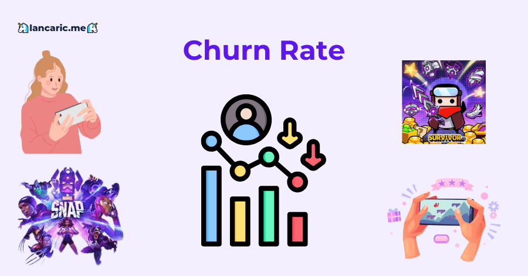
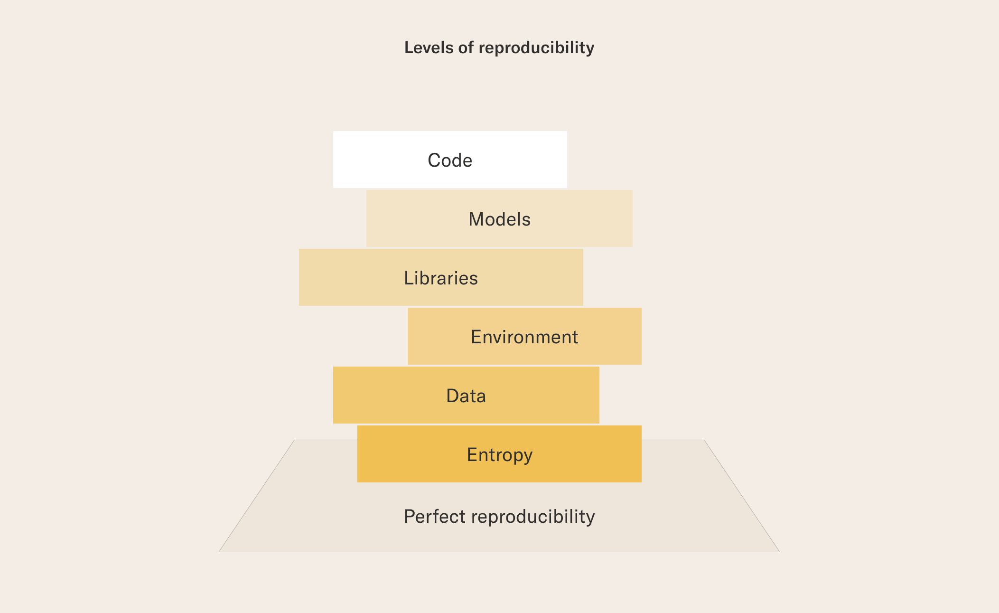
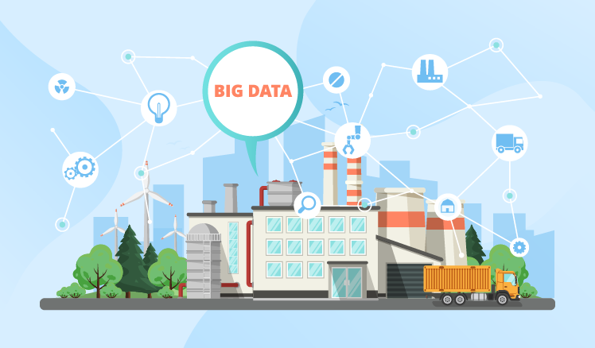
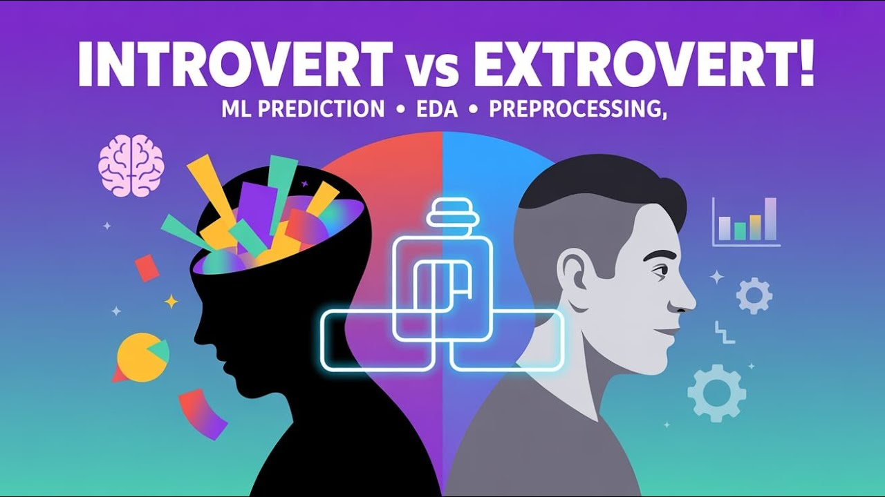

# Data Science Portfolio - Thu Pham
This portfolio showcases my Data Science and Data Analysis projects completed for academic purposes, self-learning, and personal interest. It demonstrates my ability to work across the full data workflow: data cleaning, exploration, modeling, visualization, and reproducible pipelines.

I am passionate about transforming raw data into actionable insights and building data-driven solutions that can have real-world impact.

- **Email**: [phamthu09112000@gmail.com](phamthu09112000@gmail.com)
- **LinkedIn**: [https://www.linkedin.com/in/thu-pham-417820214/](https://www.linkedin.com/in/thu-pham-417820214/)

## Projects

<table>
  <tr>
    <td width="220px" valign="top" align="center">
      <h3> (In Progress) Thesis: A Deep Learning and Linguistic Feature Analysis Approach for Sentiment Comparison </a></h3>
        
    </td>
    <td valign="top">
      I analyze 800k Twitter customer support messages using Deep Learning (RoBERTa), NLP methods (SpaCy), LLM generation (OpenAI API), linguistic feature extraction, and machine learning models to compare sentiment between human and AI responses.
      Analyses are implemented in Python and R, leveraging modern NLP and data-science packages including scikit-learn, SpaCy, NLTK, Hugging Face Transformers, and the R tidyverse. Sentiment labeling uses transformer-based models (RoBERTa) to establish a ground truth. Linguistic feature extraction uses SpaCy for POS tagging, dependency parsing, and syntactic analysis. Predictive modeling employs Logistic Regression, Random Forests, and Gradient Boosting, with SHAP values and permutation importance providing interpretability for model outputs.
    </td>
  </tr>
</table>

 

<table>
  <tr>
    <td width="220px" valign="top" align="center">
      <h3><a href="https://github.com/catherine0911/Data-Science-Portfolio_Thu-Pham/tree/87d6bab3403f216c2761fb378bf8caa2ae1293b6/Projects/Churn%20Prediction">
      Customer Churn Prediction for Mobile Game Users</a></h3>
        
    </td>
    <td valign="top">
      This project develops a pipeline to predict player churn in a mobile game using behavioral log data. I implemented a full end-to-end workflow including data cleaning, feature engineering, OP/CP window–based churn labeling, class-imbalance handling, machine learning modeling (Random Forest, XGBoost, Logistic Regression), and SHAP-based model explainability.
      The project demonstrates my ability to structure analytical problems, transform raw timestamped user logs into meaningful behavioral features, evaluate models under strong imbalance, and interpret model decisions using explainability tools. It highlights expertise in Python, pandas, scikit-learn, imbalanced-learn, XGBoost, and SHAP.
    </td>
  </tr>
</table>

 

<table>
  <tr>
    <td width="220px" valign="top" align="center">
      <h3><a href="https://github.com/catherine0911/Data-Science-Portfolio_Thu-Pham/tree/87d6bab3403f216c2761fb378bf8caa2ae1293b6/Projects/AI%20Agents">
      Multi-Agent AI for Sales Analysis</a></h3>
        
    </td>
    <td valign="middle">
      I designed and implemented a multi-agent system to automate sales data analysis and reporting. Each agent had a specific role: data cleaning, statistical analysis using Python (Pandas), insight generation with OpenAI GPT-5 Mini, and visualization with Matplotlib. The system autonomously processed a large retail dataset and generated actionable reports, including seasonal trends, top-performing categories, and potential demand forecasts. This project highlights my experience in integrating AI models, building automated data pipelines, and producing evidence-based insights ready for decision-making.
    </td>
  </tr>
</table>

<table>
  <tr>
    <td width="220px" valign="top" align="center">
      <h3><a href="https://github.com/catherine0911/Data-Science-Portfolio_Thu-Pham/tree/87d6bab3403f216c2761fb378bf8caa2ae1293b6/Projects/Reproducibilitym">
      Reproducibility</a></h3>
        
    </td>
    <td valign="middle">
      This portfolio was created for the Reproducibility and Model Deployment course. Across two end-to-end machine learning projects, I practiced using tools such as Git, Makefiles, Docker, Streamlit, and REST APIs to build reproducible pipelines for data scraping, cleaning, model training, evaluation, and deployment.
      The projects include implementing deterministic ML workflows, packaging models into APIs, containerizing applications, and managing experiment results. Together, they demonstrate my ability to design practical, structured, and reproducible data science solutions from raw data to deployed models.
    </td>
  </tr>
</table>

<table>
  <tr>
    <td width="220px" valign="top" align="center">
      <h3><a href="https://github.com/catherine0911/Data-Science-Portfolio_Thu-Pham/tree/87d6bab3403f216c2761fb378bf8caa2ae1293b6/Projects/Production%20Data%20Analysis">
      Production Data Analysis</a></h3>
        
    </td>
    <td valign="middle">
      This project analyzes production data from Spectrum Shades LLC to identify factors contributing to inconsistent concrete pigment quality. The work includes data cleaning, supplier comparison, filtering for quality-critical conditions, and statistical analysis—including correlation—to help improve product reliability and customer satisfaction.
    </td>
  </tr>
</table>

<table>
  <tr>
    <td width="220px" valign="top" align="center">
      <h3><a href="https://github.com/catherine0911/Data-Science-Portfolio_Thu-Pham/tree/87d6bab3403f216c2761fb378bf8caa2ae1293b6/Projects/Cleaning%20Robot">
      Big Data Analysis</a></h3>
        
    </td>
    <td valign="middle">
      This project explores stroke-related risk patterns in a large healthcare dataset using Big Data processing techniques with PySpark RDDs. The goal is to demonstrate the ability to handle large-scale distributed data, perform transformations, execute aggregations, and extract meaningful insights.
      The analysis focuses on three key questions:
      1. What is the stroke rate for different work types?
      2. How does stroke rate vary by residence type and marital status?
      3. Among patients aged 65+, how do smoking status and gender relate to stroke percentage?
    </td>
  </tr>
</table>

<table>
  <tr>
    <td width="220px" valign="top" align="center">
      <h3><a href="https://github.com/catherine0911/Data-Science-Portfolio_Thu-Pham/tree/fc4a7850f83a38f0ad4ea264fdcce737b471899a/Projects/Introvert%20vs%20Extrovert">
      Personality Prediction from Social Behavior Data (Kaggle Challenge)</a></h3>
        
    </td>
    <td valign="middle">
      This project predicts whether a person is an Introvert or Extrovert using behavioral and social activity features. I built a full machine-learning pipeline including preprocessing, feature transformation, cross-validation, randomized hyperparameter tuning with XGBoost, and evaluation against a baseline Dummy classifier. The tuned XGBoost model achieved 96.7% validation accuracy, significantly outperforming the baseline.
    </td>
  </tr>
</table>

<table>
  <tr>
    <td width="220px" valign="top" align="center">
      <h3><a href="https://github.com/catherine0911/Data-Science-Portfolio_Thu-Pham/tree/87d6bab3403f216c2761fb378bf8caa2ae1293b6/Projects/Grocery%20Store%20Sales">
      Grocery Store Sales</a></h3>
        
    </td>
    <td valign="middle">
      This project analyzes grocery store product data for FoodYum, a U.S.-based retail chain. It includes SQL tasks focused on data cleaning, missing value handling, and exploratory queries to support pricing and inventory decisions. The project demonstrates skills in SQL querying, data validation, and preparing datasets for analysis.
    </td>
  </tr>
</table>

<table>
  <tr>
    <td width="220px" valign="top" align="center">
      <h3><a href="https://github.com/catherine0911/Data-Science-Portfolio_Thu-Pham/tree/87d6bab3403f216c2761fb378bf8caa2ae1293b6/Projects/Cleaning%20Robot">
      Intelligent Vaccum Robot</a></h3>
        
    </td>
    <td valign="middle">
      Magic Sweeper is an intelligent robot vacuum cleaner I programmed in Python as part of an Programming class at Tilburg University. The goal was to design a bot that navigates an unknown grid-based environment, detects stains, avoids obstacles, saves energy, and cleans the entire map without ever seeing the full layout. My bot uses memory, rule-based navigation, and logic handling for stain detection, zig-zag sweeping, and obstacle avoidance. I was ranked in top 10 in the class for this project, and it showcases my skills in Python programming and algorithm design.
    </td>
  </tr>
</table>

## Core Competencies

- **Methodologies**: Machine Learning, Deep Learning, Time Series Analysis, Natural Language Processing, Statistics, Explainable AI, Big Data Analytics
- **Languages**: Python (Pandas, Numpy, Scikit-Learn, Scipy, Matplotlib), R (Dplyr, Tidyr, Ggplot2), SQL
- **Tools**: MySQL, Tableau, Git, PySpark, MS Excel

## Certificates
- [Python Data Associate Certification - Datacamp](https://www.datacamp.com/certificate/PDA0018102682971)
- [Data Analyst Associate with SQL](https://www.datacamp.com/certificate/DAA0012609714783)
